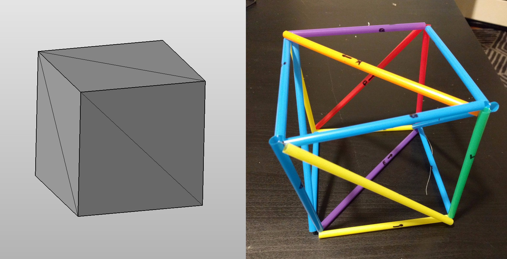

# mesh-stringer
Turns a 3D mesh into tube lengths and a plan for how to string them together.

## Usage

Give the program an STL file. It will give you a list of tubes to cut that correspond to edges in the STL. Cut out these tubes, and label them with a letter and an arrow to show which way to thread the string.

Get a long string and start running it through the tubes according to the program's printout. A tick mark (e.g. A') indicates that you should run the string through the opposite direction of the arrow.

## Sample output

<pre>
./stringer.py cube.stl

Tubes: 18
A 25.399999618530273
B 25.399999618530273
C 25.399999618530273
D 35.921024322509766
E 35.921024322509766
F 35.921024322509766
G 25.399999618530273
H 25.399999618530273
I 25.399999618530273
J 25.399999618530273
K 35.921024322509766
L 35.921024322509766
M 25.399999618530273
N 25.399999618530273
O 25.399999618530273
P 35.921024322509766
Q 25.399999618530273
R 25.399999618530273

Threading order:
R' - L' - I' - F' - A' - D - H' -
G - K - Q - P' - N - D' - C - O -
R - P' - O - E' - B - J - E' - C -
N - Q - M' - K - H' - A' - B - F'
- G - I' - J - L' - M
</pre>

## How it works

1. Naively thread each triangle separately. If you tried to build this, it would stay together but you would need 1 string per triangle.
2. Create a graph of mesh faces and how they are connected. Two faces are connected if they share an edge.
3. Calculate a spanning tree of this graph.
4. Every time the spanning tree crosses an edge, introduce a twist/swap the two strings in that edge, combining them into a single string.

The result is a single loop which threads every edge twice, and holds neighboring edges together as they meet at a vertex.
